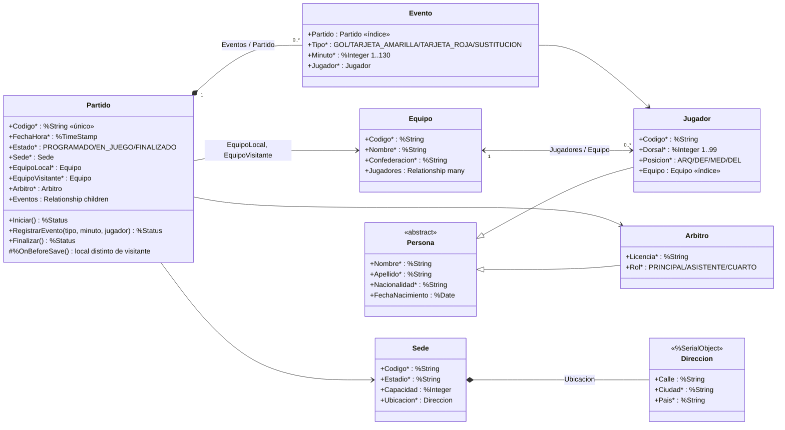

# Grupo 15 — Hito 9 — Entidades complejas del Fixture 2030 (InterSystems IRIS)

**Repositorio GitHub:** https://github.com/ttornillouade/Fixture-2030_DatosII_Grupo15

El partido del Fixture 2030 modelado como clases persistentes de InterSystems IRIS: un
partido cambia de estado y tiene eventos subordinados, los jugadores pertenecen a un equipo
y jugadores y árbitros comparten los datos de persona. La consistencia está en las propias
clases (tipos, propiedades obligatorias, relaciones y métodos), sin ORM ni middleware.

## Estructura

```text
hito-9-iris/
├── docker-compose.yml        IRIS Community + Durable %SYS en ~/docker/data/iris
├── scripts/
│   ├── Fixture/*.cls         clases del dominio (ObjectScript)
│   ├── demo_hito9.mac        demostración por bloques para el Terminal de IRIS
│   └── generar_evidencia.sh  compila, ejecuta la demo y guarda la salida
└── docs/evidencia/           salida real de la ejecución
```

## Operativa

Comandos desde esta carpeta (`hito-9-iris/`).

**1. Persistencia y arranque** (instructivo de la Clase 10):

```bash
mkdir -p ~/docker/data/iris
sudo chown -R "$(id -u):$(id -g)" ~/docker/data/iris
sudo chmod -R 777 ~/docker/data/iris
docker compose up -d
docker compose ps
```

**2. Terminal y compilación:**

```bash
docker exec -it fixture2030-iris iris session IRIS
```

```objectscript
do $system.OBJ.LoadDir("/scripts/Fixture", "ck")
```

El compilador informa las tablas SQL que crea para cada clase persistente.

**3. Demostración:** copiar en el Terminal, en orden, los bloques de
[`scripts/demo_hito9.mac`](scripts/demo_hito9.mac). Para correrla completa y guardar la salida:

```bash
bash scripts/generar_evidencia.sh
```

**4. Detener sin perder datos ni clases compiladas:** `docker compose down`. Para empezar
con una instancia vacía: `docker compose down` y `rm -rf ~/docker/data/iris`.

El Management Portal está en `http://localhost:52773/csp/sys/UtilHome.csp`. La imagen trae
usuarios predeterminados y pide cambiar la contraseña en el primer ingreso; no se versionan
credenciales.

## Diseño

Para cada entidad se respondió la pregunta de cierre de la clase: ¿tiene identidad y ciclo
de vida propios, es parte de otra entidad o es una variante estable de una clase existente?

| Entidad | Decisión | Por qué |
|---|---|---|
| `Persona` → `Jugador`, `Arbitro` | Herencia | Jugador y árbitro son tipos estables que comparten nombre, apellido, nacionalidad y fecha de nacimiento. Los estados (lesionado, expulsado) no son subclases. |
| `Equipo` ↔ `Jugador` | Relación uno a muchos | Las dos entidades son independientes: un jugador puede cambiar de equipo o quedar sin uno. |
| `Partido` ↔ `Evento` | Relación padre-hijo | Un evento no existe sin su partido: se guarda con él y se borra con él. |
| `Sede` → `Direccion` | Composición (`%SerialObject`) | La dirección no tiene identidad propia: se guarda dentro de la sede. |
| `Partido` → `Sede`, `Equipo`, `Arbitro` | Referencia | Son entidades con vida propia que un partido usa, no partes del partido. |

### Diagrama de objetos

`*` = propiedad obligatoria (`[Required]`).



### Matriz de integridad

| Regla | Mecanismo | Demo |
|---|---|---|
| Las propiedades marcadas `*` son obligatorias y con tipo estricto | `[Required]`, `%Integer(MINVAL, MAXVAL)`, `VALUELIST` | Bloque E: jugador sin `Dorsal`, rechazado |
| El árbol se guarda entero desde el padre | `%Save()` del partido guarda en una transacción todo lo alcanzable | Bloque B: un solo `p.%Save()` asigna ID a partido, sede, equipos, personas y eventos |
| **Si se borra un partido, se borran sus eventos** | Relación padre-hijo (`Cardinality = parent`) | Bloque G: borrar P002 elimina su evento |
| Si se borra un equipo, sus jugadores quedan sin equipo | Relación uno a muchos con `OnDelete = setnull` | Bloque G: el jugador de E099 sigue existiendo |
| El estado solo avanza `PROGRAMADO → EN_JUEGO → FINALIZADO` | Métodos `Iniciar` y `Finalizar` | Bloque F: iniciar un partido finalizado, rechazado |
| Solo un partido `EN_JUEGO` admite eventos | Método `RegistrarEvento` | Bloque F: gol en el minuto 0 en un partido finalizado, rechazado |
| No existe el minuto 0 | `Minuto %Integer(MINVAL = 1)` | — |
| Un equipo no juega contra sí mismo | `%OnBeforeSave` de `Partido` | — |
| Los eventos de un partido se recuperan sin recorrer la tabla | `Index PartidoIdx On Partido` (RNF3); igual en `Jugador.Equipo` | — |

Los métodos de `Partido` son la interfaz de escritura autorizada. Un `UPDATE` por SQL o un
`Eventos.Insert` directo los saltearía: SQL se usa para consultar (Clase 10, "no convertir
SQL en un atajo para romper el dominio").

## Evidencia

[`docs/evidencia/`](docs/evidencia/): IRIS 2026.2 (`latest-cd`), 8 clases compiladas sin
errores y la salida de cada bloque de la demo, comando por comando.

## Mejoras propuestas (no implementadas)

- Hacer que las reglas del partido también valgan por SQL con triggers, si el dominio
  necesitara escrituras por SQL.
- Modelar los árbitros asistentes y las alineaciones como entidades hijas del partido.
- Una forma de corregir eventos (por ejemplo, un gol anulado) sin modificar el original.
- Medir con más volumen antes de afirmar algo sobre rendimiento: esta demo valida lógica.

## Coherencia con el TPO

Se usan los mismos identificadores de los hitos anteriores (`E001`, `E001J09`, `P001`, `S01`).
IRIS guarda el partido como entidad con reglas; las estadísticas segundo a segundo siguen en
InfluxDB (Hito 8), las sesiones en Redis (Hito 7) y los comentarios en Cassandra (Hito 6).
