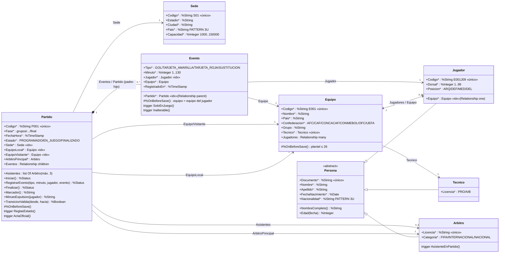

# Diagrama de objetos

Clases del paquete `Fixture` (archivos en [`src/Fixture/`](../src/Fixture/)). Todas extienden
`%Persistent` y cada una se proyecta como tabla SQL del esquema `Fixture`.

Convenciones: `*` = propiedad obligatoria (`[Required]`); `«único»` = índice único;
`«idx»` = índice simple. Las relaciones con `<-->` son bidireccionales (`Relationship` con `Inverse`).

## Tipos de asociación

| Asociación | Tipo en IRIS | Bidireccional | Qué implica |
|---|---|---|---|
| Persona → Jugador / Arbitro / Tecnico | Herencia (`Extends`) | — | Un solo extent: `Persona.%OpenId(id)` devuelve la subclase real; SQL tiene `Fixture.Persona` (todas) y una tabla por subclase. |
| Equipo ↔ Jugador | `Relationship` one / many | Sí | `equipo.Jugadores` y `jugador.Equipo` se mantienen sincronizados. Índice `EquipoIdx` en el lado "muchos". |
| Partido ↔ Evento | `Relationship` parent / children | Sí | Composición: el evento se guarda bajo el partido (ID `1\|\|3`), se guarda con él y se borra con él. |
| Partido → Sede, Equipo, Arbitro; Equipo → Tecnico; Evento → Jugador, Equipo | Referencia (`Property As Clase`) + `ForeignKey` | No | Navegable desde el objeto que referencia; la `ForeignKey` impide borrar lo referenciado. |
| Partido → Asistentes | `list Of Arbitro` | No | Grupo acotado (máx. 3). Una lista no admite `ForeignKey`: lo cubre el trigger `Arbitro.AsistenteEnPartido`. |

## Herencia y estado

Las subclases representan **tipos** que no cambian: un árbitro no se convierte en jugador.
El **estado** (programado, en juego, finalizado; expulsado) es un dato de la instancia, no una
subclase. Ver la nota de la consigna sobre "JugadorLesionado".
